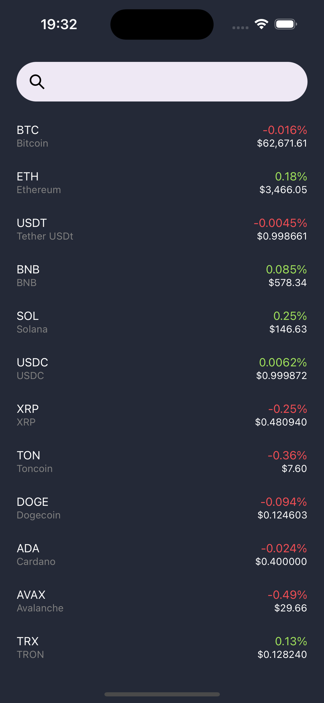
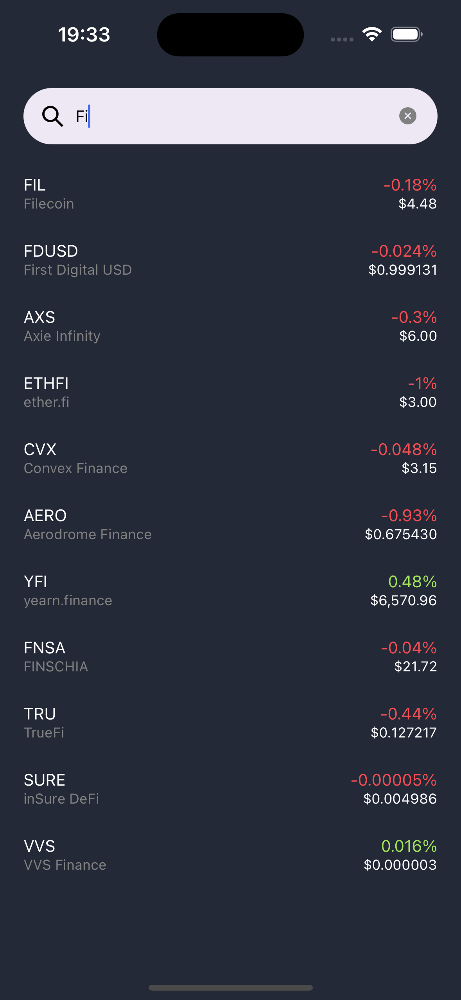

# React Native Assignment

Cryptocurrencies list application using React Native, react-native-mmkv & redux-persist

This app runs on React Native v0.74.2, React v18.2.0 with features:<br />

- Shows a list of the newest cryptocurrencies along with their names, symbols, current prices, and percentage changes
- Users have the option to search for a specific cryptocurrency using its name or symbol
- Offline support
- Pull-to-refresh to update the list
- Load more items when scrolling down

<br />Screenshots<br /><br />

<br /><br />

Try it out at<br />
https://i.diawi.com/Hvwcrx

Setup project:

```
git clone https://github.com/Dat-Mobile/GRVTAssignment.git

cd GRVTAssignment && yarn
```

Make sure SDK Enviroment is setup properly and run:

```
react-native run-android/ios
```
